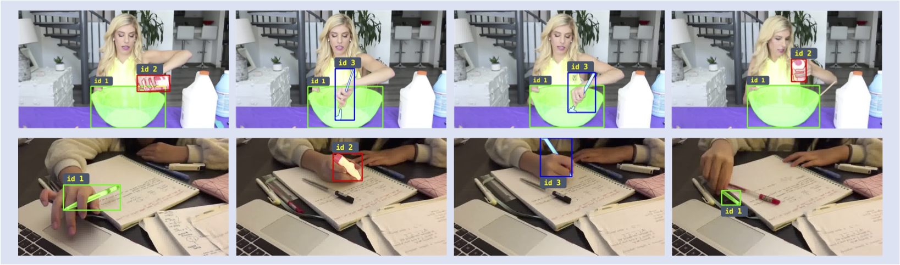

# HOIST-Former

This repository contains the code and data for the following paper:

[HOIST-Former: Hand-held Objects Identification, Segmentation, and Tracking in the Wild](https://supreethn.github.io/research/hoistformer/index.html) (CVPR 2024)

<p align="center">
    <figure>
        
            <figcaption> We develop a method to identify, segment, and track hand-held objects in videos.</figcaption>
     </figure>
</p>


## Installation

Follow the installation instructions in [INSTALL.md](INSTALL.md). 

## Project Page and Data

Please see the [project page
](https://supreethn.github.io/research/hoistformer/index.html) for the required dataset and annotation format.

Download the [data](https://drive.google.com/file/d/11Y-kHe4ixWjldY1ZyhOyR2Yfchj9S0-D/view?usp=share_link) and place it in `./data/`. 

## Models

Download a [model](https://drive.google.com/file/d/1yLXCqt8mQroqQYDnncMvJ3HaOKMln8Xs/view?usp=share_link) and place it in ```./pretrained_models/```.

## Training

Use the following command for training:

`CUDA_VISIBLE_DEVICES=0,1,2,3,4,5,6,7 python train_net_video.py --config-file configs/hoist/hoistformer.yaml --num-gpus 8`

## Evaluation

Use the following command for evaluation:

`CUDA_VISIBLE_DEVICES=0 python train_net_video.py --config-file configs/hoist/hoistformer.yaml --eval-only MODEL.WEIGHTS ./pretrained_models/trained_model.pth`

## Demo: Run HOIST-Former on Video Frames 

Use the following command to segment and track hand-held objects in videos:

`CUDA_VISIBLE_DEVICES=0 python demo.py --video_frames_path <path to a directory containing videos (assumes frames are pre-extracted)>`

The output folder with segmentation and tracking visualizations will be stored in `./output_results/`.

# Related projects for visual analysis of human hands

[Hand Generation in Diffusion Models](https://supreethn.github.io/research/handiffuser/index.html) (CVPR 2024)

[Hand-Body Association](http://vision.cs.stonybrook.edu/~supreeth/BodyHands/) (CVPR 2022)

[Hand Tracking](https://mingzhenhuang.com/projects/handler.html) (CVPR 2022)

[Hand Contact Recognition](https://github.com/cvlab-stonybrook/ContactHands) (NeurIPS 2020)

[Hand Detection](https://www3.cs.stonybrook.edu/~cvl/projects/hand_det_attention/) (ICCV 2019)

[Hand Detection in Assembly Settings](http://vision.cs.stonybrook.edu/~supreeth/Working_Hands/) (BMVC 2019)

## Citation
If you find our projects useful, please cite our work using the following:

```
@InProceedings{sn_hoist_cvpr_2024, 
	author = {Supreeth Narasimhaswamy and Huy Nguyen and Lihan Huang and Minh Hoai}, 
	title = {HOIST-Former: Hand-held Objects Identification, Segmentation, and Tracking in the Wild}, 
	booktitle = {IEEE/CVF Conference on Computer Vision and Pattern Recognition (CVPR)}, 
	year = {2024}, 
}

@InProceedings{sn_handiffuser_cvpr_2024, 
	author = {Supreeth Narasimhaswamy and Uttaran Bhattacharya and Xiang Chen and Ishita Dasgupta and Saayan Mitra and Minh Hoai}, 
	title = {HanDiffuser: Text-to-Image Generation With Realistic Hand Appearances}, 
	booktitle = {IEEE/CVF Conference on Computer Vision and Pattern Recognition (CVPR)}, 
	year = {2024}, 
}

@InProceedings{sn_bodyhands_cvpr_2022, 
	author = {Supreeth Narasimhaswamy and Thanh Nguyen and Mingzhen Huang and Minh Hoai}, 
	title = {Whose Hands Are These? Hand Detection and Hand-Body Association in the Wild}, 
	booktitle = {IEEE/CVF Conference on Computer Vision and Pattern Recognition (CVPR)}, 
	year = {2022}, 
}
            
@InProceedings{sn_handler_cvpr_2022, 
	author = {Mingzhen Huang and Supreeth Narasimhaswamy and Saif Vazir and Haibin Ling and Minh Hoai}, 
	title = {Forward Propagation, Backward Regression and Pose Association for Hand Tracking}, 
	booktitle = {IEEE/CVF Conference on Computer Vision and Pattern Recognition (CVPR)}, 
	year = {2022}, 
}

@InProceedings{sn_contacthands_neurips_2020, 
	author = {Supreeth Narasimhaswamy and Trung Nguyen and Minh Hoai}, 
	title = {Detecting Hands and Recognizing Physical Contact in the Wild}, 
	booktitle = {Advances in Neural Information Processing Systems (NeurIPS)}, 
	year = {2020}, 
}

@InProceedings{sn_handcnn_iccv_2019, 
	author = {Supreeth Narasimhaswamy and Zhengwei Wei and Yang Wang and Justin Zhang and Minh Hoai}, 
	title = {Contextual Attention for Hand Detection in the Wild}, 
	booktitle = {IEEE/CVF International Conference. on Computer Vision (ICCV)}, 
	year = {2019}, 
}

@InProceedings{sn_workinghands_bmvc_2019, 
	author = {Roy Shilkrot and Supreeth Narasimhaswamy and Saif Vazir and Minh Hoai}, 
	title = {WorkingHands: A Hand-Tool Assembly Dataset for Image Segmentation and Activity Mining}, 
	booktitle = {British Machine Vision Conference (BMVC)}, 
	year = {2019}, 
}
```
